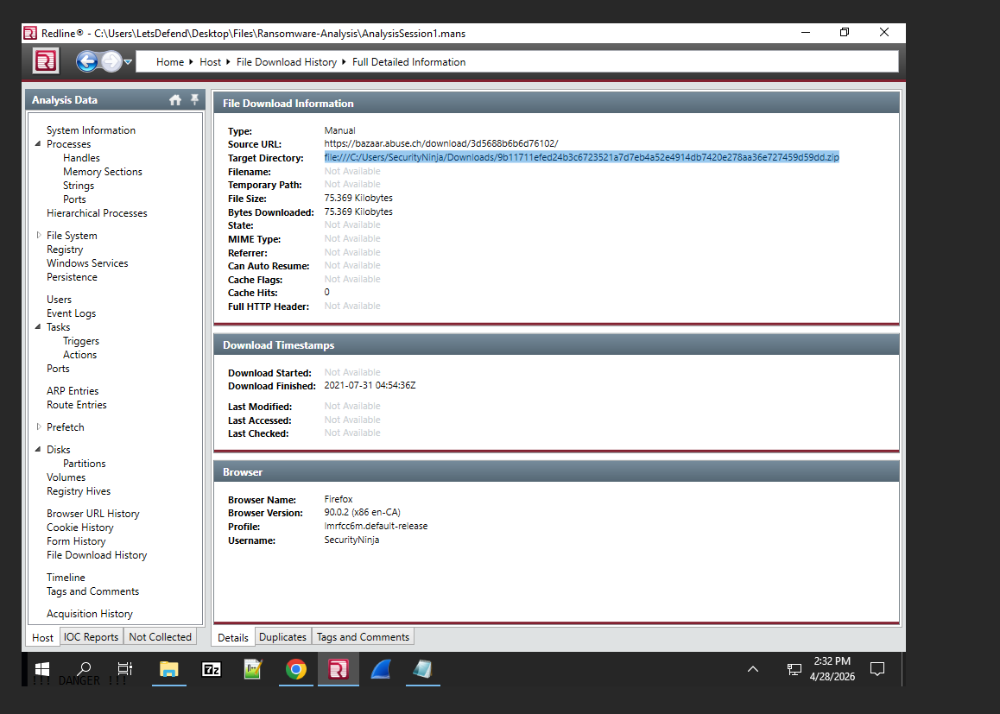
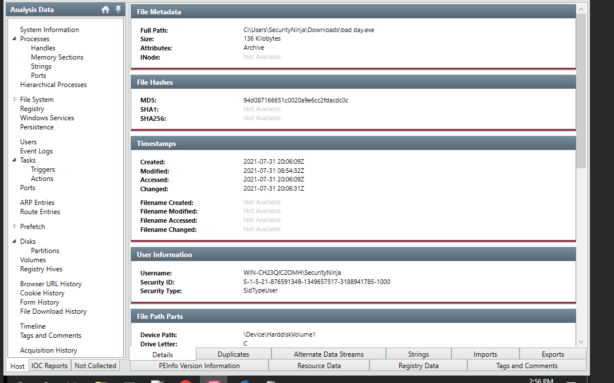
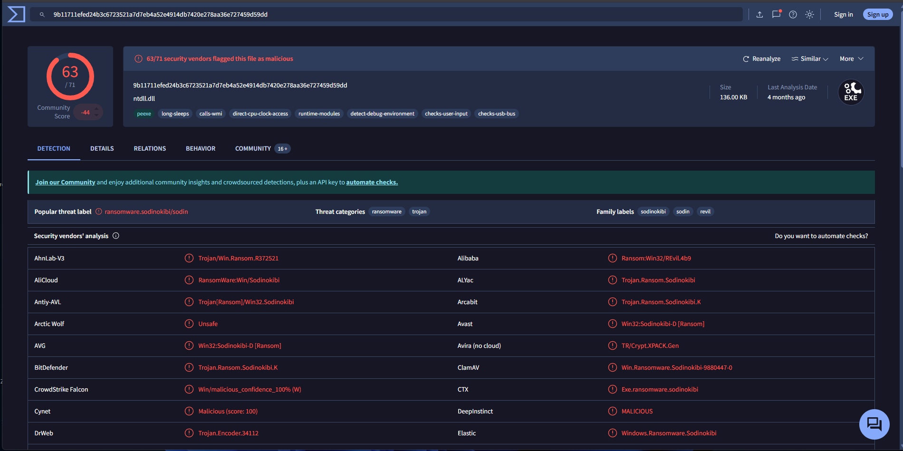
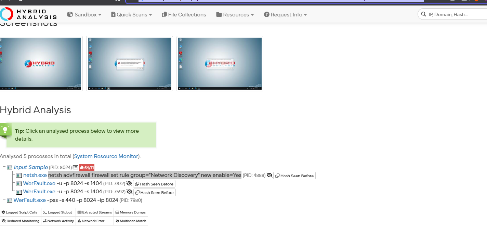
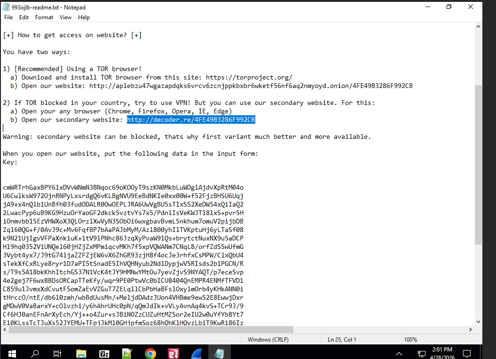
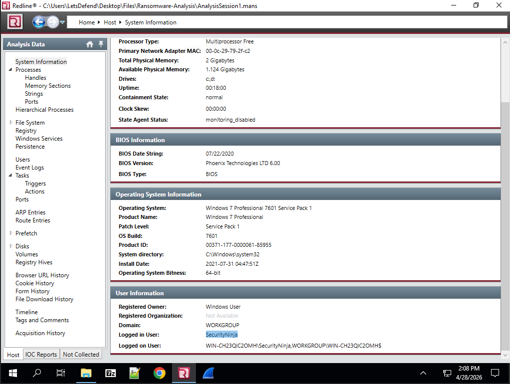
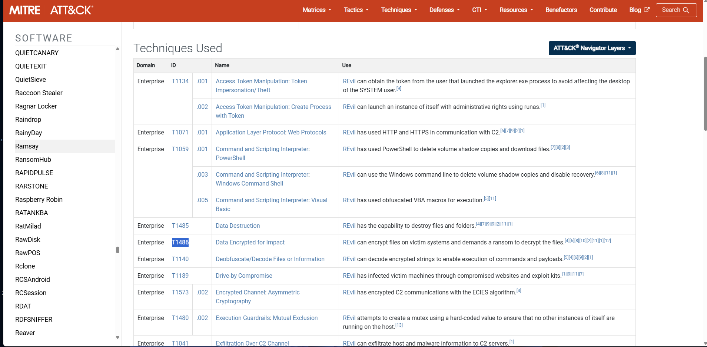

# 🔐 DFIR Case Study: REvil Ransomware Memory Analysis

## 📌 Overview
This project documents a Digital Forensics & Incident Response (DFIR) investigation of a ransomware attack using a memory dump from a LetsDefend lab.

The objective was to analyze the memory image, identify evidence of compromise, and reconstruct attacker activity related to REvil ransomware.

---

## 🎯 Objectives
- Analyze a memory dump using forensic tools  
- Identify malicious processes and artifacts  
- Extract Indicators of Compromise (IOCs)  
- Validate malware using external intelligence platforms  
- Map attacker activity to MITRE ATT&CK  

---

## 🧪 Lab Environment
- OS: Windows 7 Professional 7601 Service Pack 1  
- User: securityninja  

---

## 🧰 Tools Used
- FireEye RedLine – Memory & host analysis  
- VirusTotal – Malware reputation analysis  
- Hybrid Analysis – Dynamic malware behavior analysis  

---

## 🔍 Investigation 

### 1. System Information
- OS: Windows 7 Professional SP1  
- Logged in User: securityninja  

---

### 2. Suspicious File Identification
- File Path:

C:\Users\securityninja\Downloads\bad day.exe

- MD5 Hash:

94d087166651c0020a9e6cc2fdacdc0c

---

### 3. Malware Validation (VirusTotal)

- 63/71 security vendors flagged the file as malicious  
- Identified as REvil / Sodinokibi ransomware  

---

### 4. Behavioral Analysis (Hybrid Analysis)

- Observed execution of command:

netsh advfirewall firewall set rule group="Network Discovery" new enable=Yes

- Indicates firewall modification for network discovery / lateral movement  

---

### 5. Ransom Note Evidence

- Encrypted file extension:

.993ixjlb

- Payment portals:

http://aplebzu47wgazapdqks6vrcv6zcnjppkbxbr6wketf56nf6aq2nmyoyd.onion

http://decoder.re/4fe49b3286f992cb

---

### 6. File Download Evidence

- File downloaded from:

https://bazaar.abuse.ch/
...

---
## 🔗 Attack Flow (Kill Chain)

1. User downloaded malicious file from external source  
2. Executed `bad day.exe` from Downloads directory  
3. Ransomware launched and executed system commands  
4. Modified firewall using netsh  
5. Encrypted files with `.993ixjlb` extension  
6. Displayed ransom note with payment instructions  

## 🧬 Indicators of Compromise (IOCs)

| Type | Value |
|------|------|
| File Path | C:\Users\securityninja\Downloads\bad day.exe |
| MD5 Hash | 94d087166651c0020a9e6cc2fdacdc0c |
| Extension | .993ixjlb |
| Onion URL | aplebzu47wgazapdqks6vrcv6zcnjppkbxbr6wketf56nf6aq2nmyoyd.onion |
| Secondary URL | decoder.re |

---

## 🧠 MITRE ATT&CK Mapping

| Tactic | Technique | ID |
|-------|----------|----|
| Impact | Data Encrypted for Impact | T1486 |

---

## 📊 Key Findings

- Ransomware executed from user Downloads directory  
- Firewall rules modified using `netsh`  
- Files encrypted with custom extension  
- Ransom note provided TOR and clearnet payment portals  
- Malware confirmed via VirusTotal and Hybrid Analysis  

---

## 🧠 Key Learnings

- Memory forensics helps uncover active threats  
- Process execution and command-line analysis reveal attacker behavior  
- External tools like VirusTotal and Hybrid Analysis improve confidence  
- Ransomware often modifies system configurations (firewall, services)  
- MITRE ATT&CK mapping helps standardize understanding of attacks  

---

## 📌 Conclusion

The system was compromised by REvil ransomware, which executed from a user directory, modified firewall settings, encrypted files, and established ransom payment channels.

This investigation demonstrates how combining memory forensics with threat intelligence platforms provides a complete understanding of an attack.

---

## 🚀 Skills Demonstrated
- Memory Forensics  
- Malware Analysis  
- IOC Extraction  
- Threat Intelligence Correlation  
- MITRE ATT&CK Mapping  
- SOC Investigation Workflow  
